# 🧩 Database Selection & Architecture Reference

A comprehensive guide for selecting, combining, and visualizing different database technologies in modern system design.

---

## 📘 Database Selection Decision Table

| **Scenario** | **Recommended DB Type** | **Examples** | **Reasoning / Key Benefits** | **When *Not* to Use** | **Recommended Use Case Example** |
|---------------|--------------------------|----------------|-------------------------------|------------------------|----------------------------------|
| **Transactional system (OLTP)** | **Relational (SQL)** | PostgreSQL, MySQL, Oracle, SQL Server | ACID compliance, strong consistency, structured schema, ideal for CRUD-heavy applications. | When schema changes frequently or data is unstructured. | E-commerce orders, banking transactions, ERP systems. |
| **Analytics / Reporting (OLAP)** | **Columnar / Data Warehouse** | Snowflake, BigQuery, Redshift | Optimized for aggregations, analytical queries, and data summarization. | For frequent writes or real-time transactional workloads. | Business intelligence dashboards, sales analytics. |
| **High-speed caching** | **In-memory key-value store** | Redis, Memcached | Ultra-fast read/write, ideal for caching sessions, tokens, or computed results. | When data persistence or durability is critical. | Web session store, API rate limiter, leaderboard cache. |
| **Flexible schema / unstructured data** | **Document store (NoSQL)** | MongoDB, Couchbase | Schema-less JSON docs; great for evolving data structures (e.g., user profiles). | When strong ACID compliance or complex joins are required. | Product catalogs, user profiles, CMS systems. |
| **High write throughput / event data** | **Wide-column store** | Cassandra, HBase | Handles large write volumes and time-series data efficiently. | When strict transactional integrity or ad-hoc queries are needed. | IoT sensor logs, event tracking, telemetry systems. |
| **Graph relationships (social networks, recommendations)** | **Graph DB** | Neo4j, Amazon Neptune | Efficient traversal and relationship queries. | For simple key-value or tabular data — adds unnecessary complexity. | Social networks, fraud detection, recommendation engines. |
| **Search-heavy workloads (logs, text)** | **Search engine DB** | Elasticsearch, OpenSearch, Solr | Full-text search, indexing, and analytics on unstructured text. | For transactional data or high-frequency updates. | Log analytics, site search, application monitoring. |
| **Time-series data (IoT, metrics, monitoring)** | **Time-series DB** | InfluxDB, TimescaleDB | Optimized for timestamped data, compression, and retention policies. | For generic relational data or data with non-time-based queries. | Server metrics, IoT data, stock prices, sensor monitoring. |
| **Mobile / edge / offline-first apps** | **Embedded / local DB** | SQLite, Realm, Couchbase Lite | Works offline with sync support. | For large-scale or server-side distributed applications. | Mobile apps, edge devices, offline-first systems. |
| **Highly distributed system / global availability** | **Distributed SQL / NewSQL** | CockroachDB, YugabyteDB | SQL interface with horizontal scaling and strong consistency across regions. | For small apps where single-node SQL is sufficient. | FinTech or SaaS apps requiring global data consistency. |
| **Message streaming / event sourcing** | **Streaming DB / Log store** | Kafka, Pulsar, Redpanda | Real-time data streams, durable message logs. | For ad-hoc querying or transactional data storage. | Event-driven architecture, real-time analytics, data pipelines. |
| **Configuration / feature flag storage** | **Key-value store** | Consul, etcd, Redis | Simple key lookup, fast reads, small config data. | For large datasets or when complex querying is needed. | App configuration, service discovery, feature toggles. |

---

## ⚖️ Quick Selection by Key Need

| **Need** | **Best DB Type** |
|-----------|------------------|
| Strong consistency | SQL / NewSQL |
| High availability & scalability | NoSQL / Distributed SQL |
| Complex joins & relationships | SQL / Graph |
| High read/write performance | NoSQL / In-memory |
| Analytical queries | Data warehouse / Columnar |
| Real-time updates | Streaming / Time-series |

---

## ☁️ Cloud-Native Equivalents

| **DB Type** | **AWS** | **GCP** | **Azure** |
|--------------|----------|----------|------------|
| Relational (SQL) | RDS / Aurora | Cloud SQL | Azure SQL Database |
| Data Warehouse | Redshift | BigQuery | Synapse Analytics |
| Document Store | DocumentDB | Firestore / Mongo Atlas | Cosmos DB |
| Wide-Column Store | Keyspaces (Cassandra) | Bigtable | Cosmos DB (Cassandra API) |
| Graph DB | Neptune | Neo4j Aura | Cosmos DB (Gremlin API) |
| Search Engine | OpenSearch Service | Elastic Cloud / OpenSearch | Azure Cognitive Search |
| Time-series | Timestream | Bigtable / InfluxDB | Time Series Insights |
| In-memory Cache | ElastiCache | Memorystore | Azure Cache for Redis |
| Streaming / Log Store | MSK (Kafka) | Pub/Sub | Event Hubs |
| Key-value Config | AWS Parameter Store / etcd | Secret Manager | App Configuration |

---

## 📊 Data Volume vs Query Complexity Suitability Matrix

| **DB Type** | **Low Volume** | **Medium Volume** | **High Volume / Big Data** | **Query Complexity Support** |
|--------------|----------------|-------------------|-----------------------------|-------------------------------|
| **Relational (SQL)** | ✅ Excellent | ✅ Excellent | ⚠️ Moderate (scaling limits) | ✅✅✅ High (joins, aggregations) |
| **Data Warehouse (Columnar)** | ⚠️ Overkill | ✅ Good | ✅✅✅ Excellent | ✅✅ High (analytical queries) |
| **Document Store (NoSQL)** | ✅ Good | ✅✅ Excellent | ✅✅ Excellent | ⚠️ Limited (no complex joins) |
| **Wide-Column Store** | ⚠️ Poor | ✅ Excellent | ✅✅✅ Excellent | ⚠️ Limited (simple filters only) |
| **Graph DB** | ✅ Good | ✅ Good | ⚠️ Limited (memory heavy) | ✅✅✅ Very High (relationship traversals) |
| **Search Engine DB** | ⚠️ Poor | ✅ Excellent | ✅✅ Excellent | ✅✅ Medium (text & filters only) |
| **Time-series DB** | ⚠️ Poor | ✅ Excellent | ✅✅ Excellent | ⚠️ Low (mostly time-based) |
| **In-memory (Cache)** | ✅✅ Excellent | ✅ Good | ⚠️ Not scalable for large datasets | ⚠️ Low (key-value only) |
| **Embedded / Local DB** | ✅ Excellent | ⚠️ Limited | ❌ Not suitable | ⚠️ Low (local queries only) |
| **Distributed SQL / NewSQL** | ✅ Good | ✅ Excellent | ✅✅✅ Excellent | ✅✅ High (full SQL + scale-out) |
| **Streaming / Log Store** | ⚠️ Poor | ✅ Excellent | ✅✅✅ Excellent | ⚠️ Low (append-only reads) |
| **Key-value Store** | ✅ Excellent | ✅ Good | ⚠️ Moderate (no indexing) | ⚠️ Very low (exact key lookup only) |

✅ **Legend:**  
- ✅ Good fit  
- ✅✅ Excellent fit  
- ✅✅✅ Best-in-class fit  
- ⚠️ Limited / Needs caution  
- ❌ Not suitable  

---

## 🏗️ Modern Data Architecture with Database Roles

---

## ⚡ Real-Time Data Flow: From Transaction to Analytics

```mermaid
sequenceDiagram
    participant User as 👤 User / Client App
    participant API as 🌐 API Gateway / Service
    participant DB as 🗄️ OLTP DB (PostgreSQL / MongoDB)
    participant Cache as ⚡ Cache (Redis)
    participant Stream as 🔄 Stream Platform (Kafka / Pulsar)
    participant DW as 🧠 Data Warehouse (BigQuery / Snowflake)
    participant Search as 🔍 Search / Logs (Elasticsearch / OpenSearch)
    participant Metrics as 📈 Monitoring (InfluxDB / Grafana)
    participant BI as 📊 BI Dashboard (Looker / PowerBI)

    User->>API: Submit Transaction / Event
    API->>Cache: Write temporary data / invalidate cache
    API->>DB: Insert or update record (ACID / transactional)
    DB-->>API: Return success response
    API-->>User: Acknowledge success ✅

    Note right of API: Transaction complete in OLTP

    DB-->>Stream: Publish event (e.g., OrderCreated, UserUpdated)
    Stream-->>DW: ETL / Stream ingestion for analytics
    Stream-->>Search: Forward log or text event for indexing
    Stream-->>Metrics: Update metrics / time-series data

    DW-->>BI: Aggregate & update analytical dashboards
    Search-->>BI: Provide searchable insights
    Metrics-->>BI: Feed real-time system metrics

    BI-->>User: Display live analytics, reports, and alerts
```

---

## 🧠 Summary

- Use **OLTP (SQL/NoSQL)** for core transactions.  
- Use **Cache + Stream** to decouple real-time processing.  
- Use **OLAP, Search, and Time-series DBs** for insights.  
- Combine with **Config and Embedded layers** for flexibility.  
- Adopt **polyglot persistence** — the right database for each workload.

---

**Created for:** Architecture decision documentation, engineering onboarding, and data strategy planning.  
**Author:** _Generated with GPT-5 architecture assistant_ 💡
